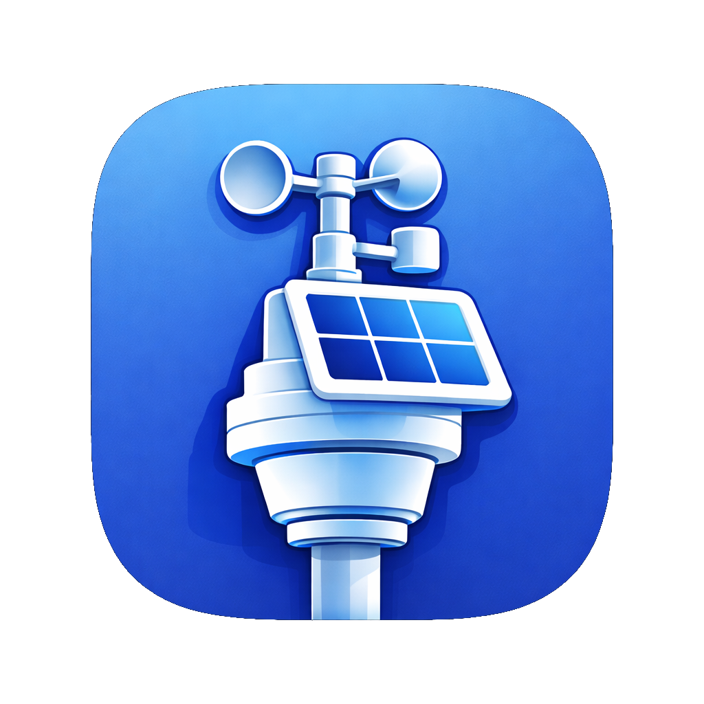

---
title: Ecowitt MenuBar
---

  

    
ecowitt-App

    

      <button id="btn-de">DE</button>
      <button id="btn-en">EN</button>
    

  

  

    
  

  

    

      <h1>🌦 Ecowitt MenuBarBeta</h1>
      

        Schlanke macOS-Menüleisten-App für deine Ecowitt-Wetterstation.
      

      <a class="btn btn-primary" href="https://github.com/ecowittApp/ecowitt-App/releases/latest">
        ⬇️ Beta herunterladen
      </a>
      <a class="btn btn-secondary" href="https://github.com/ecowittApp/ecowitt-App/issues">
        🛠 Support
      </a>
    

    

      <h1>🌦 Ecowitt MenuBarBeta</h1>
      

        Lightweight macOS menu bar app for your Ecowitt weather station.
      

      <a class="btn btn-primary" href="https://github.com/ecowittApp/ecowitt-App/releases/latest">
        ⬇️ Download beta
      </a>
      <a class="btn btn-secondary" href="https://github.com/ecowittApp/ecowitt-App/issues">
        🛠 Support
      </a>
    

  

  

    <!-- ADVANTAGES -->
    

      <h2>⭐ Vorteile</h2>
      <ul>
        <li>Schneller Überblick der wichtigsten Wetterdaten mit nur einem Klick</li>
        <li>Kein aufwendiger Programmaufruf oder Fensterwechsel mehr nötig</li>
        <li>Die relevanten Wetterinformationen jederzeit im Blick</li>
        <li>Ideal für den schnellen Check zwischendurch – direkt aus der Menüleiste</li>
      </ul>
    

    

      <h2>⭐ Benefits</h2>
      <ul>
        <li>Quick overview of key weather data with a single click</li>
        <li>No need to open a full application or switch windows</li>
        <li>Keep the most important weather information always visible</li>
        <li>Perfect for quick checks directly from the menu bar</li>
      </ul>
    

    <!-- FEATURES -->
    

      <h2>✨ Funktionen</h2>
      <ul>
        <li>Aktuelle Wetterdaten direkt in der macOS-Menüleiste</li>
        <li>Unterstützung für Ecowitt-Wetterstationen</li>
        <li>Automatische Aktualisierung</li>
        <li>Ressourcenschonend &amp; unauffällig</li>
        <li>Optimiert für Dark Mode</li>
      </ul>
    

    

      <h2>✨ Features</h2>
      <ul>
        <li>Live weather data directly in the macOS menu bar</li>
        <li>Supports Ecowitt weather stations</li>
        <li>Automatic data refresh</li>
        <li>Lightweight and unobtrusive</li>
        <li>Optimized for dark mode</li>
      </ul>
    

    <!-- SUPPORT -->
    

      <h2>🛠 Support</h2>
      

        <a href="https://github.com/ecowittApp/ecowitt-App/issues">
          👉 GitHub Issues öffnen
        </a>
      

    

    

      <h2>🛠 Support</h2>
      

        <a href="https://github.com/ecowittApp/ecowitt-App/issues">
          👉 Open GitHub Issues
        </a>
      

    

  

